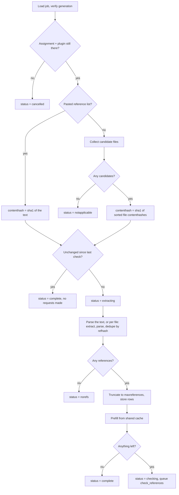
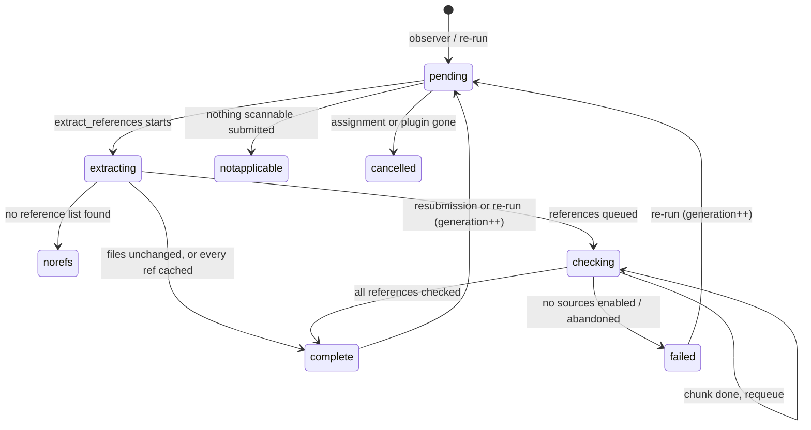

# Reference Checker — architecture

`assignsubmission_refchecker`, an assign submission subplugin for Moodle 4.5 LTS.

This document describes what the plugin does, where its ideas came from, how a check actually runs,
how each external database is queried and paced, what an administrator can see, and what is stored.

---

## 1. What the plugin is

By default the plugin makes **no submission of its own**. In that mode `allow_submissions()` returns
`false` and `is_empty()` returns `true`, so it never appears in the submission form and never affects
whether a student is considered to have submitted. What it does is:

1. observe the submission events raised by mod_assign,
2. read the files the student uploaded through the **File submissions** plugin,
3. extract the reference list from those files,
4. look each reference up in public bibliographic databases in the background,
5. contribute a status line — and optionally a summary or a full report — to the assignment UI.

Without `assignsubmission_file` enabled and visible on the assignment there is nothing to read, and
the plugin says so on the settings form ([lib.php](../lib.php) `get_settings()`) rather than leaving
a teacher to discover it after the due date.

### 1.1 Text reference lists

The per-assignment **Require text references** setting ([text_mode.php](../classes/local/text_mode.php),
config key `requiretext`) changes all of that. It has three values:

| Value | Behaviour |
|---|---|
| `no` (default) | As above. References are read out of the submitted file. |
| `optional` | A plain-text **References** box appears on the submission form. If the student uses it, that text is checked and the file is not read. If they leave it empty, extraction falls back to the file. |
| `required` | The box appears and must be filled in; a QuickForm `required` rule blocks even a draft save. The file is never read. |

Step 3 above — the least reliable part of the whole pipeline, because it depends on `pdftotext`
output and on a bibliography heading being recognisable — disappears entirely when the student
pastes their list in. That is the reason the setting exists.

In either Yes mode the plugin does accept a submission, which has consequences worth knowing about:

- `allow_submissions()` becomes `true`, which is what makes core call `get_form_elements()` and, via
  `assign::new_submission_empty()`, what lets a pasted list satisfy the assignment on its own. **This
  is what makes File submissions optional**: an assignment can be set up for the reference checker
  alone, with `assignsubmission_file` disabled.
- `is_empty()` has to answer honestly, because `assign\output\renderer` hides the status line for an
  empty plugin that allows submissions (`!is_empty() || !allow_submissions()`). In optional mode an
  empty box with a finished file-based check is therefore *not* empty — otherwise the result of the
  check that did run would vanish from the page.
- The strict "did the student submit anything?" gate is `submission_is_empty()`, which core applies
  to the form data before anything is stored. `is_empty()` is only a display and backstop signal.

The pasted text lives in its own table via
[text_submission.php](../classes/local/text_submission.php), separate from `job_manager`: it is the
student's own work and shares the submission's lifecycle (copied forward on attempt reopen, backed
up, exported for privacy), whereas a job is derived data that can be discarded and rebuilt.

---

## 2. Relationship to the upstream project

The concepts and several algorithms are ported from **References-Validation** ("CheckIfExist"),
<https://zabbonat.github.io/References-Validation/> —
source at <https://github.com/zabbonat/References-Validation>, MIT licensed, copyright
Diletta Abbonato. That project is a browser-based tool: a user pastes or uploads a document, and
JavaScript running in the page queries the bibliographic APIs directly.

### What was ported

| Area | File | What came across |
|---|---|---|
| Reference list detection and splitting | [reference_parser.php](../classes/local/reference_parser.php) | The heading-based section finder, the multilingual heading vocabulary, the numbered/unnumbered split heuristics, and the APA / Vancouver / generic metadata parsers. |
| Similarity measures | [matcher.php](../classes/local/matcher.php) | Levenshtein-based character similarity, Jaccard word-overlap similarity, taking the better of the two, and the **70% minimum title similarity** below which a candidate is rejected outright. |
| Match classification thresholds | [match_status.php](../classes/local/match_status.php) | `verified` ≥ 80, `partial` ≥ 50, otherwise `mismatch`; `notfound` when nothing was matched. Keeping these identical means results stay comparable with the upstream tool. |
| Predatory publisher list | [data/predatorylist.json](../data/predatorylist.json), [predatory.php](../classes/local/predatory.php) | The bundled list of ~20 publisher and journal names. |
| Source selection | `classes/local/source/*` | The idea of querying CrossRef, OpenAlex, arXiv, DBLP and Semantic Scholar for the same reference. |

### What was changed, and why

- **Server-side, not browser-side.** All lookups run in Moodle cron under `core\http_client`
  (Guzzle). This removes the CORS problem entirely — upstream routes arXiv through a public CORS
  proxy, which is a browser restriction that does not apply to a server (see the class comment in
  [arxiv.php](../classes/local/source/arxiv.php)).
- **A shared, paced request budget.** A browser tool serves one user at a time; a Moodle site
  serves a whole cohort hitting a deadline simultaneously. Everything in §5 — the reservation-based
  rate limiter, the circuit breaker, the site-wide result cache, the task concurrency ceiling —
  exists because of that difference and has no upstream counterpart.
- **A chain with an early-stop rule rather than "ask everyone".** See §4.3. Upstream queries
  sources and merges; here the chain stops on a strong, year-consistent match and otherwise keeps
  asking so a specialist database can correct a general one.
- **Durable job state.** Extraction and checking are Moodle adhoc tasks working through a database
  cursor, with a generation guard, retry budgets and a reconciler (§4.6). A browser tool needs none
  of this.
- **Semantic Scholar corrections.** The `isRetracted` field the upstream project requests no longer
  exists in the Graph API and requesting it fails the *whole* call with "Unrecognized or unsupported
  fields", so it is deliberately absent from the requested field list
  ([semanticscholar.php](../classes/local/source/semanticscholar.php); there is a regression test at
  [tests/source_test.php](../tests/source_test.php)).
- **Moodle integration.** Capabilities, per-assignment display levels, privacy provider, backup and
  restore, event logging, a core status check and a CLI probe are all local additions.

---

## 3. Component map

```
mod/assign/submission/refchecker/
├── lib.php                    core\check registration callback
├── locallib.php               assign_submission_refchecker — the subplugin class
├── action.php                 teacher-initiated re-run (sesskey + mod/assign:grade)
├── export.php                 download the report (sesskey + full-report entitlement)
├── settings.php               site configuration
├── cli/check_sources.php      configuration + reachability probe, one live lookup
├── classes/
│   ├── check/sources.php      core status check (Reports ▸ System status)
│   ├── event/
│   │   ├── observer.php       queues a check on submit / save
│   │   └── check_completed.php  logged when a job finishes
│   ├── task/
│   │   ├── extract_references.php   adhoc — files → references
│   │   ├── check_references.php     adhoc — references → results, in chunks
│   │   ├── job_task.php             shared trait: generation guard, queueing
│   │   └── reconcile_jobs.php       scheduled — revive/fail stalled jobs, purge cache
│   ├── local/
│   │   ├── job_manager.php     ALL reads/writes of the plugin's tables
│   │   ├── extractor.php       stored_file → plain text
│   │   ├── docx_converter.php  .docx → plain text, no LibreOffice needed (§7a)
│   │   ├── reference_parser.php  text → individual references + metadata
│   │   ├── matcher.php         scoring and issue detection
│   │   ├── predatory.php       journal/publisher list matching
│   │   ├── rate_limiter.php    per-source request pacing (shared across workers)
│   │   ├── circuit_breaker.php per-source stand-down after repeated failures
│   │   ├── job_status.php / match_status.php / display_level.php / check_timing.php
│   │   ├── json_columns.php    shared decoding of the JSON reference columns
│   │   ├── export/
│   │   │   ├── access.php          who may download a submission's report
│   │   │   ├── naming.php          filename and cover subject, blind-marking aware
│   │   │   ├── reference_rows.php  references flattened for CSV/Excel
│   │   │   └── pdf_report.php      the designed PDF document
│   │   ├── exception/          permanent | transient | rate_limited
│   │   └── source/
│   │       ├── reference_source.php  interface
│   │       ├── http_source.php       shared HTTP + status-code → exception mapping
│   │       ├── chain.php             ordering, early stop, best-answer ranking
│   │       └── crossref | openalex | arxiv | dblp | semanticscholar
│   ├── output/                 report.php, status_summary.php
│   └── privacy/provider.php
├── templates/                  view_header, status, report, reference_card, export_pdf_*
├── amd/src/reportfilter.js     client-side filter bar
├── db/                         install.xml, upgrade.php, tasks.php, events.php, access.php
├── backup/moodle2/             backup + restore subplugin classes
└── thirdparty/elephant-php/    bundled docx reader; patched to PHP 8.1 by script, not by hand (§7a)
```

---

## 4. The flow

### 4.1 Trigger

[db/events.php](../db/events.php) registers three observers, all handled by
[observer.php](../classes/event/observer.php):

| Event | Handler | Represents timing |
|---|---|---|
| `\mod_assign\event\assessable_submitted` | `assessable_submitted()` | `submit` |
| `\mod_assign\event\submission_created` | `submission_changed()` | `save` |
| `\mod_assign\event\submission_updated` | `submission_changed()` | `save` |

`submission_created` / `submission_updated` are abstract; what is actually triggered is a
subplugin's own subclass — the File submissions plugin's, or this plugin's own pair in
[classes/event/](../classes/event/) when a reference list is pasted in. Observing the abstract parent
catches both, because core resolves an event's whole ancestry when dispatching — and it avoids
hard-coding another subplugin's class name.

Those two event classes exist purely so that `checktiming = save` works with File submissions turned
off. `assessable_submitted` is raised by core itself, so `submit` timing needs nothing extra, but
nothing at all fires on a draft save unless a subplugin raises it. `save()` triggers them only when
the box is non-empty: clearing it in optional mode hands the work back to the file, which the File
submissions plugin's own event already covers. When both plugins are enabled and text was pasted,
both fire on the same save, the generation is bumped twice, and the first task abandons its work on
the generation guard — one wasted no-op task, no incorrect result.

The observer queues work only when **all** of these hold:

- the refchecker plugin is enabled and visible on the assignment,
- `assignsubmission_file` is enabled and visible, **or** `requiretext` asks for a text reference list,
- the assignment's `checktiming` setting matches the timing this observer represents.

`checktiming` is either `submit` (default — one pass per attempt) or `save` (formative feedback
while drafting, at the cost of far more external requests). When set to `save`, the submit observer
deliberately does nothing, so a submit does not queue a second identical check.

The whole observer body is wrapped in `try/catch`. Moodle's event manager does not catch observer
exceptions and this runs inside the request that saved the student's submission — anything thrown
here would surface to the student as a failed submission. This is the exact opposite of the rule the
background tasks follow, where throwing is how a retry is requested.

On a match the observer calls `job_manager::reset_for_submission()` (one transaction: delete old
references, bump `generation`, clear every counter, status → `pending`) and queues
`extract_references` with `['submissionid' => …, 'generation' => …]` as custom data.

The same two steps are the entirety of [action.php](../action.php), the teacher-facing "Re-run"
button, which additionally requires `sesskey` and `mod/assign:grade` — re-running spends the site's
external API quota, so it is restricted to people who can grade rather than anyone who can view.

### 4.2 Extraction — `extract_references`



**A pasted reference list** short-circuits everything below: `submitted_text()` returns it whenever
`requiretext` asks for one and the student filled the box in, and the file is then never opened. The
fallback that optional mode promises falls out of that condition rather than being coded separately —
an empty box simply means the file branch runs. Because a pasted list normally has no heading it goes
through `reference_parser::parse_list()` rather than `parse()`; `parse()` reports `found => false`
when no heading matches, which would make every text submission come back as `norefs`. Rows stored
this way carry no `sourcefile`, and the job no `sectionheading`.

**Candidate files** come from the `assignsubmission_file` / `submission_files` area for this
submission. `extractor::is_candidate()` filters on extension (site setting `supportedtypes`,
default `pdf, docx, odt, rtf, txt`) and size (`maxfilesizemb`, default 20 MB).

**Text extraction** ([extractor.php](../classes/local/extractor.php)) takes one of three routes:

- **PDF → `pdftotext`**, invoked as `pdftotext -layout -enc UTF-8 -q`. The `-layout` flag matters
  more than it looks: it preserves the hanging-indent structure of a reference list, which is
  exactly what the unnumbered splitter keys off. Without it every reference runs together into one
  paragraph. LibreOffice is deliberately *not* used for PDF — it imports through Draw and
  reconstructs the page as positioned text boxes, which scrambles line order. Damaged PDFs make
  `pdftotext` exit non-zero while still writing usable output, so the output file is trusted over
  the exit code.
- **DOCX → the bundled converter first** ([docx_converter.php](../classes/local/docx_converter.php)),
  gated on the `usebuiltinconverter` setting, falling back to Moodle's document converter when it
  is off or returns nothing. This is the one format the plugin can read with no subprocess, no
  external service and nothing installed, which matters because it is the most common submission
  format after PDF. See §7a below.
- **DOC / ODT / RTF → Moodle's document converter** (`core_files\converter`, normally
  LibreOffice), gated on the `uselibreoffice` setting. Anything short of
  `conversion::STATUS_COMPLETE` is treated as a miss rather than as empty text.
- **TXT** is read directly. Every route but the bundled one is optional; a site with none of them
  still checks plain text submissions.

Extracted text is normalised (forced to valid UTF-8, CRLF → LF, non-breaking spaces and soft
hyphens removed, horizontal whitespace collapsed) but **line breaks are preserved**, because the
splitter depends on them. Under `MIN_USEFUL_CHARS` (500) the result is reported as
`noextractabletext` — a scanned essay yields a handful of stray characters rather than nothing, so
an emptiness check alone would misreport it. `extract()` never throws: one unreadable file among
several is logged and stepped over.

**Parsing** ([reference_parser.php](../classes/local/reference_parser.php)) is a three-stage
pipeline:

1. `find_section()` — scan for a reference-list heading on a line of its own, tolerating numbering
   (`8.`, `VIII.`), trailing colons and leftover page numbers. Headings are recognised in English,
   Italian, Spanish, Portuguese, French and German. **The last** match in the document wins, because
   documents routinely mention "references" in body text first. Scanning stops at an end heading
   (`appendix`, `acknowledgements`, `funding`, `data availability`, …). No heading at all ⇒
   `found: false`; the whole document is never treated as a reference list, because doing so
   produces convincing nonsense.
2. `split()` — strip page numbers, running headers/footers and standalone URLs, then split. If two
   or more lines start with a number marker the list is treated as numbered and split on those
   markers. Otherwise the unnumbered (APA-style) splitter starts a new reference at a blank line
   followed by a capital, or at a capitalised opening containing a bracketed year when the previous
   reference already ended like a complete citation. Fragments under 16 or over 2000 characters are
   discarded.
3. `parse_metadata()` — try APA (`Authors (Year). Title. Journal…`), then Vancouver (numbered,
   `N. Authors. Title. Journal. Year;Vol(Issue):Pages`), then a generic fallback that picks the most
   "title-like" segment by length × proportion of lowercase words, heavily penalising segments that
   look like author lists or venue names. Year, DOI and arXiv ID are extracted independently by
   regex in all three cases. Any field that cannot be recognised is left `null` so the matcher can
   drop it from the weighting rather than scoring it as a mismatch.

> This is the least reliable part of the pipeline and the one most worth testing against real
> submissions — it was tuned on published academic PDFs, and student work is far more varied.
> Under-counting is the dangerous failure mode, which is why the matched heading is reported back to
> the reader in the report rather than silently assumed correct.

References are **deduplicated across files** by `refhash` within the submission, then truncated to
the assignment's `maxreferences` (per-assignment setting, falling back to the site default of 200);
truncation sets the job's `truncated` flag, which the report surfaces as a notice.

**Cache prefill** then satisfies whatever has already been looked up for anyone else on the site
(§5.4). If every reference is a cache hit the job completes here having made **zero** external
requests. Otherwise the status becomes `checking` and `check_references` is queued.

### 4.3 Checking — `check_references`

The task processes a bounded **chunk** (site setting `chunksize`, default 10) and then re-queues
itself, so each run stays short, progress is durable after every chunk, and a retry resumes where
the last attempt stopped. The cursor lives in the data — `next_queued_references()` selects rows
with `status = 'queued'` — not in the task's custom data.

For each reference, `chain::check()` walks the enabled sources in **registry order**, not in the
order the administrator ticked them in the settings multi-select:

```
crossref → openalex → arxiv → dblp → semanticscholar
```

CrossRef first because its coverage best matches what students actually cite; the two general
databases before the two specialist ones. Default enabled set: `crossref, openalex, arxiv, dblp`.

For each source in turn:

- If the circuit breaker is **open** for that source, skip it and note it as unavailable.
- Call `$source->check($reference)`; record success/failure with the circuit breaker.
- `rate_limited_exception` is **re-thrown immediately** — backpressure is the caller's decision to
  act on, not something to route around.
- `transient_exception` is remembered, the source is noted as unavailable, and the chain moves on.
- `permanent_exception` is logged at `DEBUG_DEVELOPER` and the chain moves on.
- A returned record is scored by `matcher::score()`.

**Scoring** ([matcher.php](../classes/local/matcher.php)):

- `titlescore` — better of Levenshtein and Jaccard similarity on normalised text. A candidate title
  appearing verbatim inside the expected string scores 95, which handles the case where the parser
  could not isolate a title and passed the whole reference. Below **70** the candidate is rejected
  outright and treated as not found: reporting "not found" is far less damaging than confidently
  showing a student a different paper and telling them it is theirs.
- `authorscore` — family names only, and only as many of the record's authors as the reference
  actually named. Reference lists abbreviate given names inconsistently and routinely truncate long
  author lists; scoring against the full list would mark a correctly cited eight-author paper at 25%
  because the student named two. A hit plus "et al." scores 100. DBLP's disambiguation digits
  (`Xiaopeng Zhang 0009`) are discarded automatically.
- `journalscore` — plain similarity.
- `confidence` = weighted mean with **title 0.6, authors 0.3, journal 0.1**, renormalised over only
  the fields that are actually comparable, so a reference that omits the journal is not punished for
  omitting it.
- `issues[]` — actionable discrepancies: authors disagree (`authorscore < 50`), cited year differs
  from found year by **more than one** (a single year is normally online-first vs. issue
  publication), or the cited DOI differs from the found DOI.
- The found journal is tested against the predatory list, and the flag is stored on the record.

`confidence` is then classified: **≥ 80 verified**, **≥ 50 partial**, otherwise **mismatch**.

**Early stop.** The chain returns immediately only when the result is `verified`, confidence ≥ 90,
**and** the year agrees with what the reference claimed (±1, or either side unknown). Confidence
alone is not enough: widely cited papers get re-deposited under fresh identifiers, so a search can
return a convincing match to a copy published years after the one the student read. CrossRef and
OpenAlex both answer *Attention Is All You Need* with 2025 re-deposits while arXiv still returns the
genuine 2017 paper. Requiring year agreement lets a later source correct that, at the cost of one
extra request only when the first hit is doubtful.

**Otherwise**, every remaining source is asked and the best answer wins, ranked in this order:

1. match status (`verified` > `partial` > `mismatch` > `notfound`),
2. year agreement,
3. confidence,
4. title score.

Year agreement outranks confidence deliberately — it is what distinguishes the edition the student
actually cited from a later copy of the same work.

**Giving up.** The chain throws `transient_exception` only when **nothing answered at all**. One
flaky database must not fail a submission: three services saying "not in my index" is a real answer,
and a fourth being briefly unreachable does not make it untrustworthy. Nothing answering is a
different claim — reporting "not found" then would mean saying a work does not exist on the strength
of a search that never happened.

**Degraded results.** If the outcome is `notfound` *and* at least one source could not be consulted,
the result is flagged `degraded`. A degraded result is **never written to the shared cache** — a
single outage would otherwise teach every later submission on the site that a real work does not
exist. A positive result is never degraded: finding the work is a true positive however many other
databases were down, so it is safe to keep and to cache.

### 4.4 Per-source behaviour

All five extend [http_source.php](../classes/local/source/http_source.php), which owns request
pacing, timeout handling, polite-pool parameters and — the decision that matters most — the mapping
from HTTP outcome to exception kind, so no task ever has to interpret a status code:

| Outcome | Mapped to | Effect |
|---|---|---|
| Network error, DNS failure, timeout | `transient_exception` | source noted unavailable; reference requeued |
| `404` | `null` (not an error) | a direct lookup for something not indexed |
| `429` | `rate_limited_exception(Retry-After)` | task reschedules itself for that moment |
| `5xx` | `transient_exception` | routine for DBLP, which signals overload with 500 |
| other `4xx` | `permanent_exception` | logged; chain moves on |
| body not JSON/XML | `permanent_exception` | logged; chain moves on |

Request timeout is the `requesttimeout` setting (default 30 s). Every source asks for **5
candidates** and re-ranks them locally on title similarity plus a year bonus, because a service's
own relevance ordering answers a different question from "is this the work the student cited".

Assuming a contact email and Semantic Scholar API key **are** configured:

#### CrossRef — `https://api.crossref.org/works`

- **Order:** first. Widest coverage of what students actually cite — journal articles, but also
  books, chapters, conference proceedings, dissertations and standards, which are exactly the
  material that otherwise comes back "not found" and erodes trust in the whole report.
- **Lookup:** a DOI in the reference is resolved directly (`/works/{doi}`). A DOI that does not
  resolve is itself a finding, but the work may exist under another identifier, so the code falls
  through to search. Search uses `query.bibliographic` with the **raw citation string** (whitespace
  collapsed, capped at 500 characters) — that endpoint is CrossRef's reference-matching entry point
  and is designed to take a whole citation, so the raw text beats the parsed title here.
- **Retractions:** authoritative. CrossRef publishes Retraction Watch data, and `update-to`
  relationships of type retract/withdraw are read directly, with a title-prefix check as a backstop
  for publishers who signal a retraction only by renaming the article.
- **Citations:** `is-referenced-by-count`.
- **Polite pool:** yes — `mailto` is appended to every query.
- **Pacing:** default **100 ms** minimum gap (`rateinterval_crossref`).
- **Availability probe:** `rows=1&select=DOI`.

#### OpenAlex — `https://api.openalex.org/works`

- **Order:** second. Earns its place on what CrossRef indexes only patchily — preprints and much
  conference material, which matters most in computing, engineering and physics where a reference
  list can be largely arXiv and proceedings.
- **Lookup:** DOI direct (`/works/doi:{doi}`), otherwise `filter=title.search:…`. There is no
  citation-string matching endpoint, so this searches the **parsed title**; when the parser could
  not isolate a title (< 10 characters) the search is skipped entirely rather than sending a whole
  citation to a title filter, which returns confident nonsense. Commas, pipes and colons are
  stripped because OpenAlex's filter syntax treats them as operators.
- **Retractions:** the `is_retracted` flag.
- **Citations:** `cited_by_count`.
- **Polite pool:** yes — `mailto`.
- **Pacing:** default **100 ms** (`rateinterval_openalex`).
- **Availability probe:** `per_page=1&select=id`.

#### arXiv — `https://export.arxiv.org/api/query`

- **Order:** third. Preprints, which CrossRef and OpenAlex index inconsistently. It also gets
  *versions* right where the others do not — the *Attention Is All You Need* case above.
- **Lookup:** an arXiv ID found in the reference (modern `2301.12345v2` or pre-2007 `cs.CL/0112017`
  form, bare or inside an arxiv.org URL) becomes a direct `id_list` lookup — an identifier turns a
  search into a lookup. Otherwise a quoted `ti:"…"` search, skipped for titles under 10 characters.
- **Format:** Atom XML, not JSON, so it uses `fetch_xml()`. Everything before decoding is shared
  with the JSON path, which is what keeps the two from drifting apart on status-code interpretation.
- **Journal:** where a preprint has since been formally published, arXiv records `journal_ref`,
  which is a better answer for the student than "arXiv" alone.
- **Retractions:** **weak** — title/abstract prefix convention only. Absence means nothing.
- **Citations:** none published (`null`).
- **Polite pool:** no. `mailto` is deliberately not sent to services that do not operate one; on a
  service that treats unknown parameters as part of the query it could actively distort results.
- **Pacing:** default **3000 ms** — arXiv asks for roughly one request every three seconds
  (`rateinterval_arxiv`).
- **Availability probe:** `id_list=1706.03762`. Unlike the base implementation, a well-formed *empty*
  feed counts as available — it is a perfectly good answer.

#### DBLP — `https://dblp.org/search/publ/api`

- **Order:** fourth. Indexes computer science conference proceedings thoroughly — exactly the
  material CrossRef and OpenAlex cover least well. In that discipline a reference list can be mostly
  proceedings papers, so without DBLP a great many correctly cited works come back "not found".
- **Lookup:** title search only (`q=…&format=json&h=5`); there is no identifier path. Titles under
  10 characters are skipped, and non-alphanumeric characters are stripped from the query. A DOI is
  recovered from the `doi` field or, failing that, parsed out of the `ee` electronic-edition links.
- **Quirks:** signals overload with **HTTP 500 rather than 429**, so 5xx → transient → retry is the
  routine path for this source, and it is the main reason the circuit breaker exists. Author lists
  arrive in three different shapes (bare string, `{text: …}` object, or unwrapped when there is only
  one), all three handled in `authors()`.
- **Retractions:** **weak** — title prefix only.
- **Citations:** none published (`null`).
- **Polite pool:** no.
- **Pacing:** default **1000 ms** (`rateinterval_dblp`).
- **Availability probe:** `q=test&h=1`.

#### Semantic Scholar — `https://api.semanticscholar.org/graph/v1/…`

- **Order:** fifth, and **off by default**. Without an API key the service puts every anonymous
  caller in one shared pool: two requests a few seconds apart are enough to be refused, so at cohort
  scale it would spend most of its time rate limited and risks having the institution's address
  throttled. `is_available()` returns `false` outright when no key is configured, so the reason shows
  up in the status report as a configuration problem rather than as a stream of rate-limit errors.
- **Authentication:** the configured key is sent as the `x-api-key` header
  (`assignsubmission_refchecker/semanticscholarkey`, stored via `admin_setting_configpasswordunmask`).
- **Lookup:** DOI direct (`/paper/DOI:{doi}`), otherwise `/paper/search?query=…`.
- **Fields:** `paperId,title,authors,year,venue,externalIds,url,citationCount,publicationTypes,journal`.
  `isRetracted` is deliberately absent — see §2.
- **Retractions:** **weak** — `publicationTypes` containing "retract", plus the title convention.
- **Citations:** `citationCount`.
- **Polite pool:** no (it uses a key instead).
- **Pacing:** default **3000 ms** (`rateinterval_semanticscholar`) — with a key this can usually be
  lowered to match the rate your key is provisioned for.
- **Availability probe:** `query=test&limit=1&fields=paperId`.

### 4.5 Recording a result

`job_manager::record_result()` writes the outcome onto the reference row (match status, confidence,
the three sub-scores, the found bibliographic record, DOI, URL, citations, retracted/predatory flags,
issue count and issue JSON) and `cache_put()` stores it in the site-wide cache — **unless** the
result was degraded.

`job_manager::recalculate_counters()` then recomputes the job's counters with a **single aggregate
query** over the reference rows, rather than keeping a running tally. A retried or partially applied
chunk therefore cannot leave the counters drifting away from the rows they describe. The same query
computes the temporal statistics (oldest/newest/average year) and citation totals.

### 4.6 Failure handling, retries and reconciliation

There are four independent safety nets, each bounding a different failure mode:

| Mechanism | Constant / setting | Bounds |
|---|---|---|
| Per-reference attempt budget | `MAX_REFERENCE_ATTEMPTS = 3` | one stubborn reference holding a submission at "15 of 16" forever |
| Per-reference retry delay | `RETRY_DELAY = 120 s` | a requeued reference being picked straight back up and burning its whole budget in seconds |
| Per-source circuit breaker | §5.2 | a sick database costing one failed request *per reference* |
| Per-job requeue budget | `MAX_REQUEUES = 1`, `staletimeout` (6 h) | a job stalled forever because its adhoc task exhausted the task API's retries and was dropped |

`check_one()` never lets a single reference bring the task down. A `permanent_exception` or a
`transient_exception` (nothing answered) calls `record_reference_failure()`, which increments
`attempts`, stamps `timechecked` (this is what the retry delay measures), and either puts the row
back in the queue or — at the limit — marks it `error` with `matchstatus = notfound`.

An **empty chunk does not mean the job is done**: `count_queued_references()` distinguishes
"finished" from "everything left is serving out a retry delay", and in the latter case the task
re-queues itself after `RETRY_DELAY` rather than reporting the submission complete with references
still outstanding.

A `rate_limited_exception` reaching the task is handled as **backpressure, not a fault**: counters
are recalculated, the task re-queues itself for the moment the service nominated, and it returns
normally. Throwing would work but would also inflate Moodle's own fail delay for a completely
routine event.

> **Catch it before `transient_exception`, always.** `rate_limited_exception` *extends*
> `transient_exception`, so any handler that lists the parent first swallows every rate limit as an
> ordinary fault. `check_one()` catches and re-throws it explicitly for this reason, as does
> `chain::check()`. Getting this wrong is silent and expensive: the task never backs off, so it
> keeps calling a service that just asked it to stop; each 429 spends one of the reference's three
> attempts; and after three the reference is recorded as **not found** with the rate-limit message
> shown against it — a wrong answer presented to a student for a problem that was never theirs.
> `test_rate_limiting_reschedules_without_throwing()` asserts that nothing at all is written to the
> reference rows, which is what actually pins the ordering; the reschedule assertions do not, since
> the task re-queues itself either way and only the delay differs.

Every task run begins with the **generation guard** in
[job_task.php](../classes/task/job_task.php): the job is re-read straight from the database
(bypassing the per-request cache) and abandoned unless its `generation` still matches the value in
the task's custom data. A student resubmitting mid-check bumps the generation, so the in-flight task
silently stands down instead of overwriting the newer results with stale ones. `load_assign()`
additionally abandons the job if the assignment, course module or plugin has since gone away
(status → `cancelled`).

Task deduplication matches on class, component and custom data — and the custom data carries the
generation, so a resubmission is never mistaken for a duplicate of the check it replaced.
Deduplication is switched **off** when a task queues its own successor, because the running task's
own queue row still exists and would match itself.

[reconcile_jobs.php](../classes/task/reconcile_jobs.php) runs **every 2 hours at a random minute**
(`db/tasks.php`) and closes the one hole the task API leaves open — an adhoc task that exhausts its
retries is simply dropped. It:

1. purges expired cache entries,
2. blanks stored reference text older than `retaindays`, if that is set (§7),
3. finds jobs in `pending` / `extracting` / `checking` whose `timemodified` is older than
   `staletimeout` (default 6 h), and for each one that has **no matching row left in
   `task_adhoc`**, either re-queues it once (resuming at extraction if nothing was stored, at
   checking otherwise) or, if it has already been revived once, fails it with errorcode `abandoned`.

The `task_adhoc` lookup mirrors core's own deduplication comparison, including
`sql_compare_text($customdata, strlen + 1)` — the default 32-character truncation would make
different submissions' custom data look identical.

### 4.7 Job state machine



`notapplicable`, `norefs`, `complete`, `failed` and `cancelled` are terminal; `pending`,
`extracting` and `checking` are the in-progress states the reconciler watches.

---

## 5. Rate limiting, back-off and caching

These four mechanisms together are why a whole cohort submitting at a deadline does not get the
institution's IP address into a penalty box.

### 5.1 Request pacing — `rate_limiter`

Pacing is **site-wide, not per-worker**. Each source has one row in
`assignsubmission_refchecker_rate` holding `nextallowedms`, the next unreserved request slot in
**Unix milliseconds**. Milliseconds, not seconds, because the polite-pool intervals are sub-second
and rounding them up to whole seconds would throttle CrossRef and OpenAlex tenfold.

A caller **reserves a slot** rather than holding a lock while it waits:

1. Take a short lock on `assignsubmission_refchecker_rate` / *source* (10 s timeout).
2. `slot = max(now, nextallowedms)` — never schedule into the past, so a long idle period does not
   bank up credit.
3. Write back `nextallowedms = slot + interval`.
4. Release the lock, **then** wait until `slot`.

Because the lock is held only long enough to claim a moment, several cron workers take *consecutive*
slots instead of queueing behind each other. Failure to acquire the lock is not fatal — pacing is a
courtesy, and refusing to search because a lock was busy would be worse than two workers briefly
sharing a slot.

`throttle()` is called from `http_source::send()`, so **no source can bypass it by accident**.

- Waits **under 5 s** (`MAX_INLINE_WAIT`) are slept through — shorter than the cost of rescheduling.
- Waits **of 5 s or more** throw `rate_limited_exception`, handing the wait back to the task API. A
  cron worker asleep for a minute is a worker doing nothing. The reserved slot simply goes unused,
  which costs nothing but a small gap.

Default intervals, all overridable per source in the settings page:

| Source | Default gap | Why |
|---|---|---|
| CrossRef | 100 ms | polite pool is generous |
| OpenAlex | 100 ms | polite pool is generous |
| DBLP | 1000 ms | starts returning 500s under load |
| arXiv | 3000 ms | asks for ~1 request / 3 s |
| Semantic Scholar | 3000 ms | shared anonymous pool; with a key, tune to your quota |

### 5.2 Circuit breaker

Per source, stored in the same table (`failures`, `skipuntil`).

- The first **2** failures are ignored (`FAILURES_BEFORE_BACKOFF`) — services hiccup, and standing
  one down on a single blip loses answers it could have given.
- From the second failure the source is stood down for
  `min(60 × 2^(failures − 2), 900)` seconds — **60 s, 120 s, 240 s, 480 s, then capped at 900 s**
  (`BASE_BACKOFF`, `MAX_BACKOFF`). However bad things get, it is retried at least every 15 minutes.
- **Any** successful response clears both counters immediately, so a service that recovers is
  trusted again at once rather than serving out a backoff it no longer deserves. (The write is
  skipped when there is nothing to clear, since this runs after every successful request.)

While a source is stood down, `chain::check()` skips it and adds it to the `unavailable` list. This
turns one failure into one skipped request rather than one failed request, one wait and one log line
*per reference*. It is deliberately per source: a stand-down never affects the others, and the
answers from the healthy services are still used.

### 5.3 Honouring `429` / `Retry-After`

`http_source::send()` maps `429` to `rate_limited_exception`, parsing `Retry-After` as either a
number of seconds or an HTTP date. Missing or unparseable ⇒ `DEFAULT_RETRY_AFTER` = 60 s. The value
is clamped to `[1, 3600]` by `get_retry_after()`. `chain::check()` re-throws it untouched and
`check_references` reschedules itself for exactly that moment.

### 5.4 Result cache

`assignsubmission_refchecker_cache` is a **site-wide** cache keyed on
`sha1(matcher::normalize($rawreference))` — a one-way hash of the normalised reference. Students on
a course cite much the same literature, so after the first few submissions this removes a large
share of the external requests, and it is the main reason checking stays inside the services' rate
limits at cohort scale.

- Written on every clean result; **never** on a degraded (not-found-while-a-source-was-down) one.
- The payload is the outcome and the found record only. `raw`, `rawref` and `query` are explicitly
  unset before storing — this table is shared across the whole site and must never become a store of
  student-authored text.
- TTL from `cachettl`, default **30 days**; expired rows are purged by `reconcile_jobs`.
- `hits` counts reuse.

### 5.5 Throughput ceiling

Three settings bound how fast the site talks to the outside world:

- **`maxconcurrency`** (default 2) — the adhoc task concurrency limit for `check_references`, i.e.
  how many of these tasks may run at once site-wide. This is the hard ceiling and the main
  protection against a deadline overwhelming a service.
- **`chunksize`** (default 10) — references per task run.
- **`interchunkdelay`** (default 0) — pause between chunks.

Note that per-source intervals cap aggregate throughput regardless of concurrency, because the
reservation table is shared: raising `maxconcurrency` gets more work done in parallel across
*different* sources, not more requests per second to any one of them.

An unchanged resubmission is skipped entirely by the `contenthash` check, and a reopened attempt
copies the previous attempt's job and references forward verbatim (`copy_submission()` →
`job_manager::copy_to_submission()`) because the files are identical and re-checking would spend
quota to arrive at the same answer.

---

## 6. Reports and system status tools

### 6.1 Display levels

Three levels ([display_level.php](../classes/local/display_level.php)), set per assignment
(`studentdisplay`), with a site-wide default (`defaultstudentdisplay`, shipped as **Status only**):

| Level | Value | Student sees |
|---|---|---|
| `STATUS_ONLY` | 0 | The status line only |
| `SUMMARY` | 1 | Status line plus aggregate counts |
| `FULL` | 2 | Everything, including each individual reference |

Anyone holding **`assignsubmission/refchecker:viewfullreport`** (teacher, editingteacher, manager by
archetype) always gets `FULL`, whatever the assignment says. The capability is deliberately not
granted to students — a student reaches the full report only through the per-assignment setting.

`view()` **re-derives** the level rather than trusting that the viewer arrived via the expand
control, because `assign::view_plugin_content()` is reachable directly by URL and checks only
whether the viewer may see the submission at all.

### 6.2 Assignment page header — `view_header()`

Rendered for everyone whenever the plugin is enabled, before any submission exists. Shows the
site's configurable **student information** HTML (falling back to a default lang string), the
configurable **privacy notice** if set, and then either:

- for students, a sentence stating what *they* will see at this assignment's display level, or
- for teachers, a note naming the level their *students* have, plus a warning if File submissions is
  not available on this assignment.

### 6.3 Status line — `view_summary()`

Rendered once per grading-table row, so it stays deliberately small. Shows the job status
(`checking` interpolates "n of m, p%"), and at `SUMMARY` or above a row of verified / partial /
mismatch / not-found badges. Teachers additionally see the errorcode and error message when there is
one; students never do.

Nothing at all is shown to students for a `notapplicable` or `cancelled` job — teachers get a quiet
note so they can tell "not configured" from "nothing to do".

To keep the grading table cheap, `job_manager::get_job()` **primes the whole assignment's jobs on
first use** into a per-request cache; without it a 300-student assignment would issue 300 queries to
render one page. The status line reads only the counters denormalised onto the job row, so it costs
no extra queries at all.

### 6.4 Full report — `view()`

[report.php](../classes/output/report.php) + `templates/report.mustache`:

- **Dashboard** — total, verified, partial, mismatch, not found, with issues; retracted and
  predatory callouts when non-zero; and temporal statistics (oldest year, newest year, average year,
  total and average citations). Every value comes off the job row, so the dashboard costs no extra
  queries however many submissions are on screen.
- **Qualifying notices** — the bibliography heading that was actually matched
  (`sectionheading`) and a truncation notice when the reference count hit the cap. These are what
  let a reader tell "16 references, all fine" from "we only managed to read 16 of your references".
- **Filter bar** — All / Verified / Partial / Mismatch / Not found / With issues, with counts.
  Filtering is purely client-side ([reportfilter.js](../amd/src/reportfilter.js)): every reference is
  already in the DOM, the handler is delegated from `document` so a grading view expanding several
  reports works without re-initialising, and the report stays fully usable with JavaScript off.
- **Reference cards** (`FULL` only — the rows are not even loaded below that level). Each shows the
  raw reference as the student wrote it, the source file it came from, a status badge, confidence,
  the matched record (title, authors, year, journal, DOI link, citation count), retracted and
  predatory flags, the specific issues found, the three sub-scores, and a **Google Scholar search
  link** — not-found is frequently a coverage gap rather than a fabrication, so students need
  somewhere obvious to go and check for themselves. Teachers additionally see which source answered.
- **Diagnostics** (teachers only) — completion time, errorcode and error message.
- **Download** (`FULL` only) — PDF, Excel and CSV links to `export.php`. See 6.5.
- **Re-run** (requires `mod/assign:grade`) — posts to `action.php`.

Badge colours are chosen carefully: `notfound` is `secondary`, never `danger`, because a correctly
cited book that simply is not indexed would otherwise be presented to the student as an error.

> **Note:** the `formatted` column (APA / MLA / ISO 690 / BibTeX renderings) is read by the report
> and rendered by `reference_card.mustache`, but nothing in the production code path currently
> writes it — only the test generator does. The card section is therefore never shown in practice.
> This is a known gap, not a bug in the reader.

### 6.5 Downloading the report — `export.php`

[export.php](../export.php) serves one submission's report as PDF, Excel or CSV. Reachable by
**exactly the people the full report is reachable by**, which is not the same as the capability
holders: [access.php](../classes/local/export/access.php) asks both questions, in order —

1. may this viewer see this submission at all (`require_view_submission()`, or
   `require_view_group_submission()` when the submission carries no `userid`), which is what stops
   one student reading another's report by incrementing the id; then
2. is their effective display level `FULL`, which is what lets a student in a `FULL` assignment
   download their own report and stops a `SUMMARY` one downloading anybody's.

No new capability: adding an `:export` one would break the student-at-`FULL` case, which is the
whole requirement.

**Formats.** CSV and Excel go through `\core\dataformat::download_data()` with rows flattened by
[reference_rows.php](../classes/local/export/reference_rows.php) — 15 columns, plus `source` and
`sourcefile` for teachers only. PDF is a *designed* document
([pdf_report.php](../classes/local/export/pdf_report.php)) rather than the `dataformat_pdf` grid,
which at 17 equal-width landscape columns is unreadable and clones the whole TCPDF object per cell.
The layout is mustache rendered into `writeHTML()`, one call per reference; both templates carry a
docblock listing the small HTML subset TCPDF actually supports.

**References never straddle a page break.** A reference split across pages separates the submitted
text from the verdict on it, which is the one comparison the document exists to support. TCPDF
cannot be asked to avoid this in advance — there is no way to measure arbitrary HTML without
laying it out — so `write_together()` writes each block inside a transaction, and if the block
spilled onto a new page, calls `rollbackTransaction(true)` (the in-place form; the default returns
a *different* object and would leave the caller holding the old one), adds a page, and rewrites.
Blocks already at the top of a page skip the transaction entirely, since a block that does not fit
there does not fit anywhere; one taller than a whole page splits and is not retried, so there is no
loop. Only one clone is alive at a time.

**Constraints the file itself explains.** `NO_OUTPUT_BUFFERING` is defined before `config.php`, so
from that point any stray byte — a `debugging()` notice, a PHP warning — corrupts the download
instead of being displayed. Hence: `$PAGE->set_url()` and `set_context()` set early so the renderer
never has to complain, every capability check and every `throw` above the first write, no
`$OUTPUT->header()` anywhere, and `die` after both writers (neither `download_data()` nor TCPDF's
`Output()` exits). `\core\dataformat` appends the file extension; TCPDF does not.

Exports always contain the **whole** reference list, whatever the on-screen filter is set to: a
file somebody archives should be the complete record. Blind marking is honoured in the filename and
on the cover ([naming.php](../classes/local/export/naming.php)) — a marker deliberately kept from a
student's identity must not be handed it by a download.

### 6.6 System status check

[classes/check/sources.php](../classes/check/sources.php), registered through the
`assignsubmission_refchecker_status_checks()` callback in [lib.php](../lib.php), appears under
**Site administration ▸ Reports ▸ System status**. It exists so a silent failure — every submission
sitting at "Pending" because an address was never configured or `pdftotext` is missing — is visible
without anyone thinking to look at the plugin. The plugin's settings page carries a link straight to
it rather than duplicating it as a bespoke test page.

It reports:

- **Warnings**: no contact email; `pdftotext` missing or not executable; no sources enabled;
  Semantic Scholar enabled without an API key (named explicitly, because it would otherwise just
  look like an outage); any enabled source that fails its availability probe.
- **Details**: the `pdftotext` path in use, each source that answered, and the configured file types.

Result is `OK` when there are no problems, `WARNING` otherwise, with an action link to the plugin
settings page. Note that it makes **one live request per enabled source** each time it runs.

### 6.7 CLI probe

```bash
php mod/assign/submission/refchecker/cli/check_sources.php
php mod/assign/submission/refchecker/cli/check_sources.php -r="Smith, J. (2023). A paper that does not exist. Nature, 999."
```

Prints the configuration (contact email, `pdftotext` state, file types, converter), then each
enabled source's reachability and configured interval, then parses and resolves one reference —
defaulting to a known real paper — showing the parsed metadata, the match status, confidence,
sub-scores, the found record and elapsed time. This is the fastest way to answer "is it the parser
or the lookup?" for a reference a marker is suspicious about.

### 6.8 Logging and privacy reporting

- **`\assignsubmission_refchecker\event\check_completed`** is triggered whenever a job completes,
  carrying `submissionid`, `totalrefs`, `verifiedrefs` and `notfoundrefs`. It appears in the
  standard log reports and gives anything wanting to react to a finished check something to observe.
- **Backup and restore** ([backup/moodle2/](../backup/moodle2/)) attach the job and its references
  to each submission. The plugin owns no file areas and stores no user ids of its own, so sitting
  under mod_assign's submission element is enough for a backup *without* user data to exclude all of
  it automatically.
- **Privacy** ([provider.php](../classes/privacy/provider.php)) declares all three data tables plus
  an external-location link for each of the five databases, and exports the full per-reference
  result under the submission's subcontext. Deletion is wired to submission, user and assignment
  scope.

---

## 7. Database tables

Four tables, all owned exclusively by
[job_manager.php](../classes/local/job_manager.php) — centralising every read and write is what
makes the generation invariant enforceable.

### 7.1 `assignsubmission_refchecker` — one job per submission

The unit of work: **exactly one row per `assign_submission`**, enforced by a `foreign-unique` key.

| Group | Columns | Notes |
|---|---|---|
| Identity | `assignment`, `submission` | `submission` already carries userid, groupid and attemptnumber, so none are duplicated here |
| Lifecycle | `status`, `generation`, `requeues` | `generation` is bumped on every re-trigger; tasks abort when it no longer matches their custom data. `requeues` bounds the reconciler. |
| Input fingerprint | `contenthash` | sha1 of the sorted source-file content hashes — an unchanged resubmission skips re-checking |
| Counters | `totalrefs`, `checkedrefs`, `verifiedrefs`, `partialrefs`, `mismatchrefs`, `notfoundrefs`, `issuerefs`, `retractedrefs`, `predatoryrefs`, `totalcitations` | Denormalised so the grading table and dashboard render with no extra queries. Always recomputed by one aggregate query, never incremented. |
| Statistics | `oldestyear`, `newestyear`, `avgyear`, `avgcitations` | Nullable; `avgyear` / `avgcitations` are `number(6,2)` / `number(10,2)` |
| Qualifiers | `truncated`, `sectionheading` | The bibliography heading that was matched, so readers can sanity-check what was found |
| Diagnostics | `errorcode`, `errormessage` | `errorcode` is machine-readable and never shown raw to students; `errormessage` is teachers and admins only |
| Timing | `timequeued`, `timestarted`, `timecompleted`, `timemodified` | |

**Indexes:** `assignment, status` for teacher-side aggregates over an assignment;
`status, timemodified` for the reconciler's stalled-job query.

### 7.2 `assignsubmission_refchecker_refs` — one row per extracted reference

| Group | Columns | Notes |
|---|---|---|
| Ownership | `jobid`, `submission`, `sortorder` | `submission` is denormalised from the job so privacy deletes and backup are a single hop |
| Input | `rawref`, `sourcefile`, `refhash` | `rawref` is exactly what the student wrote; `refhash` is the cache key |
| Progress | `status`, `attempts`, `timechecked` | `status` (`queued` / `checked` / `error`) **doubles as the chunking cursor**; `timechecked` is stamped on requeue too, because it is what the 120 s retry delay measures |
| Verdict | `matchstatus`, `matchconfidence`, `titlescore`, `authorscore`, `journalscore`, `source` | |
| Matched record | `foundtitle`, `foundauthors` (JSON array), `foundyear`, `foundjournal`, `doi`, `url`, `citations` | |
| Flags | `retracted`, `predatory`, `numissues`, `issues` | `numissues` exists so the job counters can be aggregated in SQL without decoding JSON; `issues` is display-only and never queried |
| Reserved | `formatted` | JSON of apa / mla / iso690 / bibtex. Read by the report, but not currently written by production code (§6.4) |
| Error | `errormessage` | |

**Indexes:** `jobid, sortorder` (display order), `jobid, status` (the chunking cursor), `refhash`.

### 7.3 `assignsubmission_refchecker_cache` — shared lookup cache

Site-wide and **contains no student-authored text**: the key is a one-way hash and the payload is
scrubbed of `raw` / `rawref` / `query` before storage.

| Column | Purpose |
|---|---|
| `refhash` | sha1 of the normalised reference — **unique** index |
| `payload` | JSON of the found bibliographic record and outcome |
| `matchstatus`, `source` | Denormalised for inspection |
| `hits` | How many times this entry has been reused |
| `timecreated`, `timeexpiry` | `timeexpiry` is indexed, and drives the reconciler's purge |

Never written for a degraded result — see §4.3.

### 7.4 `assignsubmission_refchecker_text` — the pasted reference list

One row per submission, holding the student's own work rather than anything derived from it. Written
by `save()`, copied by `copy_submission()`, deleted by `remove()` and `delete_instance()`, and
included in course backups and privacy exports.

| Column | Purpose |
|---|---|
| `assignment`, `submission` | `submission` is **foreign-unique**: at most one list per submission |
| `referencetext` | The reference list exactly as pasted. Plain text, never HTML |
| `timecreated`, `timemodified` | |

Stored as `PARAM_RAW` and escaped on output, not cleaned on input: `PARAM_TEXT` runs `strip_tags()`,
which would silently swallow legitimate fragments such as `Smith <2020>`.

### 7.5 `assignsubmission_refchecker_rate` — per-source pacing and health

One row per source, shared across all cron workers. Serves both the rate limiter and the circuit
breaker.

| Column | Purpose |
|---|---|
| `source` | Source name, e.g. `crossref` — **unique** index |
| `nextallowedms` | Unix time in **milliseconds** of the next unreserved request slot (see §5.1) |
| `failures` | Consecutive transient failures; reset by any successful response |
| `skipuntil` | Unix time until which this source is stood down |
| `timemodified` | |

Holds no user data at all. `rate_limiter::reset()` and `circuit_breaker::reset()` clear it, which is
worth knowing after a configuration change.

---

## 7a. The bundled DOCX converter

`thirdparty/elephant-php/` holds [elephant-php](https://github.com/endless-creativity/elephant-php)
**v0.4.1** (BSD-2-Clause), a dependency-free PHP port of mammoth.js, declared in
[thirdpartylibs.xml](../thirdpartylibs.xml). Only `src/` is vendored — no `bin/`, no tests, no
Composer machinery. Moodle gives plugins no Composer autoloader and its own class loader will not
resolve a non-Moodle namespace, so
[thirdparty/elephant-php/autoload.php](../thirdparty/elephant-php/autoload.php) is a hand-written
PSR-4 shim, the same approach `local/faultreporting` takes.

**Raw text, not HTML or Markdown.** `Converter::extractRawText()` emits one paragraph per block
separated by a blank line, which is exactly the shape
[reference_parser](../classes/local/reference_parser.php) wants: `find_section()` needs the heading
alone on its own line, and the unnumbered splitter starts a new reference at a blank line followed
by a capital. `convertToMarkdown()` would prefix the heading with `#` and fail `heading_regex()`,
producing a document in which no reference list can be found. `tests/extractor_test.php` counts the
references it gets back rather than just the characters, because that is the only assertion that
would notice such a regression.

**The sources are patched from PHP 8.2 to 8.1.** Upstream declares `"php": "^8.2"` and needs it for
exactly one construct: `readonly class`, in 42 files. Nothing else in the 72 source files is
8.2-only. Since Moodle 4.5 supports PHP 8.1–8.3 and the target site runs 8.1, shipping that floor
would have made this whole feature dead code on the only server that matters, so
[apply-php81-patch.php](../thirdparty/elephant-php/apply-php81-patch.php) rewrites the shorthand
longhand — `final readonly class X` plus bare properties becomes `final class X` with each of the
101 properties marked `readonly`. Identical semantics, verified on 8.1 by asserting that writing to
a patched property still throws `Error`, not merely that the files parse.

So **do not hand-edit `src/`** — change the patch script and re-run it. The script asserts it found
42 classes and 101 properties and exits non-zero otherwise, because a half-patched tree is worse
than an unpatched one, and `test_vendored_library_carries_the_php81_patch()` fails the suite if a
re-vendor lands unpatched code. The full procedure is in
[PATCHES.md](../thirdparty/elephant-php/PATCHES.md).

The hazard that shaped the design is still worth understanding, because it constrains the code even
now: `readonly class` is a *parse* error before 8.2, and a parse error in an autoloaded file is
fatal and cannot be caught. That is why `docx_converter::is_available()` is consulted **before**
`autoload.php` is required rather than being wrapped in a try/catch around it. Keep that ordering.
`MIN_PHP_VERSION` is now `80100`, matching Moodle's own floor, so in practice the only thing that
can make `is_available()` false is a missing `ext-zip` — which Moodle requires anyway. The fallback
to LibreOffice is retained regardless, since a converter that quietly declines is much better than
one that takes the submission down with it.

Failure modes, all confirmed against the library rather than assumed:

| Input | Library behaviour | `docx_converter::extract()` |
|---|---|---|
| Valid `.docx` | Returns text | Returns text |
| Not a zip / missing file / no `word/document.xml` | Throws `RuntimeException` | `null`, logged at `DEBUG_DEVELOPER` |
| Valid `.docx` with no text | Returns `''` | `null`, **not** logged — nothing went wrong |

`null` in every case means "fall through to LibreOffice", never "this submission is empty". Size is
already bounded by `maxfilesizemb` in `extractor::is_candidate()` before any of this runs, which is
what limits zip-decompression exposure.

---

## 8. Configuration reference

Site settings ([settings.php](../settings.php)). There is deliberately **no** site-wide "disable"
setting: mod_assign already owns `assignsubmission_refchecker/disabled` through the submission plugin
management page.

| Setting | Default | Effect |
|---|---|---|
| `default` | off | Enabled by default on new assignments |
| `contactemail` | — | Puts CrossRef and OpenAlex requests in their polite pools. **Highest-impact setting on the page.** |
| `sources` | crossref, openalex, arxiv, dblp | Which databases to query |
| `semanticscholarkey` | — | Required before enabling Semantic Scholar |
| `rateinterval_*` | 100 / 100 / 3000 / 1000 / 3000 ms | Minimum gap between requests, per source |
| `pathtopdftotext` | `/usr/bin/pdftotext` | PDF extraction |
| `usebuiltinconverter` | on | DOCX extraction via the bundled library; takes priority over `uselibreoffice`. Needs only `ext-zip` — see §7a |
| `uselibreoffice` | on | DOC/ODT/RTF extraction via Moodle's converter, and DOCX when the bundled one does not apply |
| `supportedtypes` | pdf, docx, odt, rtf, txt | |
| `maxfilesizemb` | 20 MB | |
| `chunksize` | 10 | References per task run |
| `maxconcurrency` | 2 | Concurrent `check_references` tasks site-wide |
| `interchunkdelay` | 0 | Pause between chunks |
| `requesttimeout` | 30 s | Per HTTP request |
| `maxreferences` | 200 | Cap per submission (overridable per assignment) |
| `cachettl` | 30 days | |
| `staletimeout` | 6 h | Before the reconciler considers a job stalled |
| `retaindays` | 0 (keep) | Blank stored reference text after this many days, keeping the result |
| `studentinformation`, `privacynotice` | — | HTML shown on the assignment page |
| `defaultstudentdisplay` | Status only | |
| `defaultchecktiming` | On submit | |
| `defaultrequiretext` | No | Whether new assignments start out asking for a text reference list |

Per-assignment settings: `studentdisplay`, `checktiming`, `maxreferences`, `requiretext`.

---

## 9. Design rules worth preserving

These recur throughout the code and are the reasoning most likely to be lost in a later change:

1. **Never claim a work does not exist on the strength of a search that did not happen.** Nothing
   answering is not the same as everything answering "no". Degraded negatives are retried and never
   cached.
2. **"Not found" must never read as an accusation.** It is frequently a coverage gap. Hence the
   `secondary` badge, the Google Scholar link, and reporting the matched bibliography heading so a
   reader can see what the parser actually read.
3. **A confident wrong answer is worse than no answer.** Hence the 70% title floor, and requiring
   year agreement before stopping the chain early.
4. **Silence from the predatory list means nothing.** It holds ~20 names. A hit is worth showing; the
   absence of one is not a clean bill of health, and the wording says "appears on a list" rather than
   making a judgement.
5. **Retraction data is authoritative only from CrossRef and OpenAlex.** For arXiv, DBLP and Semantic
   Scholar it is a title-prefix convention and must never be read as an all-clear when absent.
6. **Observers must never throw; tasks must.** Throwing in an observer fails the student's
   submission. Throwing in a task is how a retry is requested.
7. **Nothing student-authored goes in the shared cache.** It is site-wide.
8. **Operational detail is teachers-only.** Error codes and messages never reach students.
9. **The display level is re-derived wherever the report is rendered**, never inherited from how the
   page was reached.
